# Guided call flow — state diagram

Source of truth for the state machine is `src/guidedFlow.js`'s
`GUIDED_SECTIONS` array — this diagram is a hand-maintained view of it,
not generated. If a section's `id`, `verb`, or `next`/`branch` changes
in the code, update the matching node/edge below. Renders natively on
GitHub, in most Markdown editors with a Mermaid plugin, or paste the
block into https://mermaid.live to edit visually.

```mermaid
stateDiagram-v2
    direction TB

    [*] --> contact_info

    state "contact_info\n[RECORD] name + address" as contact_info
    state "claim_info\n[RECORD] claim # + carrier" as claim_info
    state "assignment\n[AIGATHER] contacted_party_name,\npresent_at_inspection" as assignment
    state "mortgage\n[AIGATHER] mortgage_status,\nmortgage_company" as mortgage
    state "origin\n[RECORD] origin_narrative" as origin
    state "coverage\n[AIGATHER] cause + determination\n+ supporting_detail" as coverage
    state "risk_information\n[AIGATHER] stories, type, foundation,\nsqft, beds, baths, occupancy" as risk_information
    state "risk_siding_year\n[AIGATHER] siding_type,\nyear_built" as risk_siding_year
    state "roof_status\n[GATHER] branch only" as roof_status
    state "roof_shingle\n[AIGATHER] covering, age, condition,\npitch, damage_narrative" as roof_shingle
    state "roof_other\n[RECORD] roof_narrative_freeform" as roof_other
    state "exterior\n[AIGATHER] exterior_status,\nexterior_narrative" as exterior
    state "interior\n[RECORD] interior_damage_narrative\n(optional)" as interior
    state "personal_property\n[AIGATHER] status,\npersonal_property_narrative" as personal_property
    state "mitigation\n[AIGATHER] status,\nmitigation_narrative" as mitigation
    state "overhead_profit\n[RECORD] overhead_profit_narrative" as overhead_profit
    state "subrogation\n[RECORD] subrogation_reason" as subrogation
    state "coinsurance\n[RECORD] coinsurance_narrative" as coinsurance

    contact_info --> claim_info
    claim_info --> assignment
    assignment --> mortgage
    mortgage --> origin
    origin --> coverage
    coverage --> risk_information
    risk_information --> risk_siding_year
    risk_siding_year --> roof_status

    roof_status --> exterior: not_affected
    roof_status --> roof_shingle: shingle
    roof_status --> roof_other: other_material

    roof_shingle --> exterior
    roof_other --> exterior

    exterior --> interior
    interior --> personal_property
    personal_property --> mitigation
    mitigation --> overhead_profit
    overhead_profit --> subrogation
    subrogation --> coinsurance
    coinsurance --> [*]: finalize — stitch section\ntranscripts + captured fields,\nwrite job.transcript (pending)

    classDef record fill:#dbeafe,stroke:#1d4ed8,color:#1e3a8a
    classDef gather fill:#fef3c7,stroke:#b45309,color:#78350f
    classDef aigather fill:#ede9fe,stroke:#6d28d9,color:#4c1d95

    class contact_info,claim_info,origin,roof_other,interior,overhead_profit,subrogation,coinsurance record
    class roof_status gather
    class assignment,mortgage,coverage,risk_information,risk_siding_year,roof_shingle,exterior,personal_property,mitigation aigather
```

## Legend

- 🔵 **RECORD** — plain narration, transcribed, no live parsing; the
  transcript arrives asynchronously via `guided_transcription` and is
  attributed back to this section's slot.
- 🟠 **GATHER** — the one true branch point. Resolved synchronously
  (speech or a silent DTMF fallback) in `resolveGatherBranch()`;
  decides which state comes next, so it can't be bundled into a wider
  AIGather turn — see `docs/telnyx-texml-interactive-ivr.md`.
- 🟣 **AIGATHER** — one bundled exchange resolving a branch/enum field
  and its natural attached detail (or a cluster of free-text facts) in
  a single turn. Result arrives synchronously on the same `action`
  callback that advances the state.

`roof_status` is the only node with more than one outgoing edge — every
other transition is a straight line, matching `GUIDED_SECTIONS`' linear
`next` chain. Both `roof_shingle` and `roof_other` rejoin at `exterior`,
same as the code.
